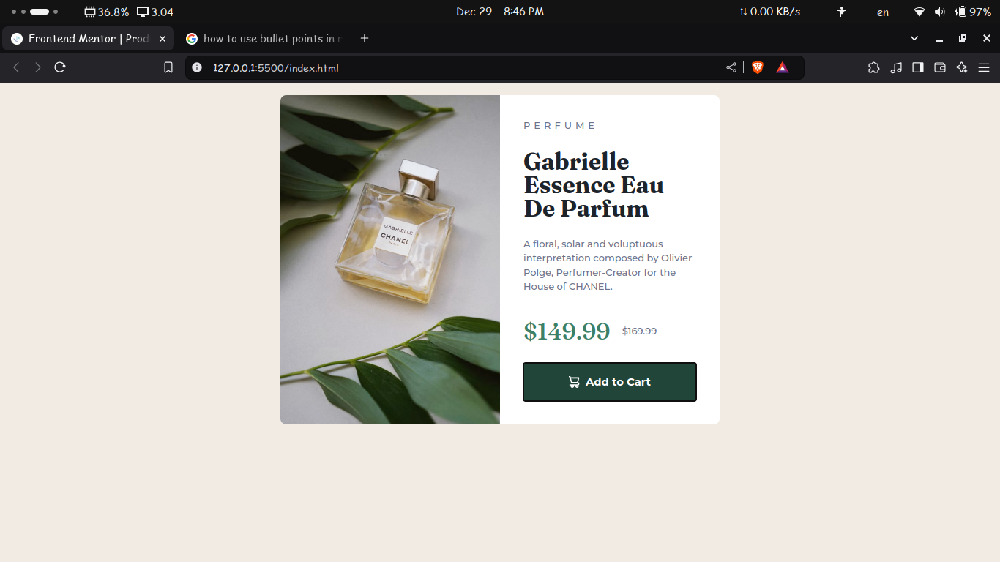

# Frontend Mentor - Product preview card component solution

This is a solution to the [Product preview card component challenge on Frontend Mentor](https://www.frontendmentor.io/challenges/product-preview-card-component-GO7UmttRfa). Frontend Mentor challenges help you improve your coding skills by building realistic projects. 

## Table of contents

- [Overview](#overview)
  - [The challenge](#the-challenge)
  - [Screenshot](#screenshot)
  - [Links](#links)
- [My process](#my-process)
  - [Built with](#built-with)
  - [What I learned](#what-i-learned)
  - [Continued development](#continued-development)
  - [Useful resources](#useful-resources)
- [Author](#author)
- [Acknowledgments](#acknowledgments)

**Note: Delete this note and update the table of contents based on what sections you keep.**

## Overview

### The challenge

Users should be able to:

- View the optimal layout depending on their device's screen size
- See hover and focus states for interactive elements

### Screenshot

### Links

- Solution URL: [Solution URL here](https://github.com/rajin-siam/product-preview-card-component)
- Live Site URL: [Live site URL here](https://rajin-siam.github.io/product-preview-card-component)

## My process

### Built with

- Semantic HTML5 markup
- CSS custom properties
- Flexbox
- CSS Grid
- Mobile-first workflow

### What I learned

1) Got a better understanding about how to name css classes

2) What is mobile fiest design

3) Learned about Grid little bit

4)how to use root selector in a better way

5) why we need to use rem and em instead of pixels

6) How to change picture with respect to dimention or responsive design

### Continued development

 I will use this component in my web project.

### Useful resources

  https://www.youtube.com/watch?v=B2WL6KkqhLQ

## Author

- Website - [Md. Rajin Mashrur Siam](https://rajin-siam.github.io/Portfolio/)
- Frontend Mentor - [@rajin-siam](https://www.frontendmentor.io/profile/yourusername)
- LinkedIn - [md-rajin-mashrur-siam](https://www.linkedin.com/in/md-rajin-mashrur-siam/)

